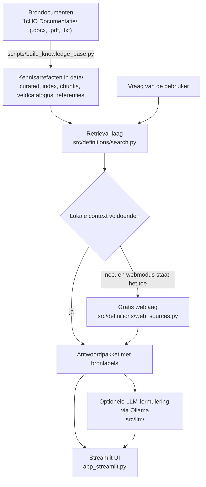

# HO Definitiezoeker (VU EA Conversational AI)

Een lokale, gratis-only vraag-en-antwoordapp over de **1cijferHO-documentatie (1cHO 2025)**. Je stelt in gewoon Nederlands een vraag ("Wat is een internationale student?", "Waar verwijst `Opleiding historisch equivalent` naar?", "Toon alle velden van `Inschrijvingen_aggr_UNL_2025.csv`") en krijgt een antwoord dat aantoonbaar is terug te voeren op de officiële brondocumenten die in deze repository staan.

Het project is **evidence-first**: elk antwoord vermeldt uit welke bron het komt, wanneer aanvullende documentatie is gebruikt, wanneer een bron ontbreekt, en wanneer een tekst slechts een LLM-interpretatie is. Er wordt niets gegokt en er is geen betaalde API of API key nodig.

---

## Inhoud

1. [Snelstart: alleen `main.py` draaien](#1-snelstart-alleen-mainpy-draaien)
2. [Wat `main.py` precies doet](#2-wat-mainpy-precies-doet)
3. [Vereisten](#3-vereisten)
4. [Wat het project doet](#4-wat-het-project-doet)
5. [Hoe het werkt](#5-hoe-het-werkt)
6. [Projectstructuur](#6-projectstructuur)
7. [Alle commando's van `main.py`](#7-alle-commandos-van-mainpy)
8. [Ollama-modellen beheren](#8-ollama-modellen-beheren)
9. [Kennisbank opnieuw bouwen](#9-kennisbank-opnieuw-bouwen)
10. [Tests en evaluatie](#10-tests-en-evaluatie)
11. [Gratis-only ontwerp](#11-gratis-only-ontwerp)
12. [Webbronnen: allowlist, modi en discovery](#12-webbronnen-allowlist-modi-en-discovery)
13. [Bronstatus en interpretatie in de UI](#13-bronstatus-en-interpretatie-in-de-ui)
14. [Problemen oplossen](#14-problemen-oplossen)
15. [Beperkingen](#15-beperkingen)

---

## 1. Snelstart: alleen `main.py` draaien

```bash
git clone <repo-url>
cd VU-EA-Conversational-AI

# Aanbevolen: eigen virtual environment
python -m venv .venv
source .venv/bin/activate          # Windows: .venv\Scripts\activate

# Dit ene commando doet de rest
python main.py
```

`python main.py` zonder verdere argumenten installeert de dependencies, haalt het benodigde Ollama-model op en start de Streamlit-app. De app opent op <http://localhost:8501>. Stoppen doe je met `Ctrl+C`.

In PyCharm of VS Code is het equivalent: open `main.py` en klik op **Run** — er zijn geen extra run-configuraties, scripts of omgevingsvariabelen nodig.

> **Eerste keer duurt langer.** De Python-pakketten zijn samen enkele honderden MB's en het standaard Ollama-model `qwen3:8b` is ongeveer 5 GB. Daarna is elke start snel: bestaande pakketten en modellen worden herkend en niet opnieuw gedownload.

> **Zonder Ollama werkt de app ook.** Als Ollama niet is geïnstalleerd, meldt `main.py` dat en start de app gewoon door. Je krijgt dan de volledige retrieval-antwoorden uit de lokale documentatie; alleen de optionele LLM-formuleerlaag is uitgeschakeld.

---

## 2. Wat `main.py` precies doet

`python main.py` voert drie stappen uit, in deze volgorde:

| # | Stap | Commando dat intern draait | Gedrag bij problemen |
|---|------|----------------------------|----------------------|
| 1 | **Dependencies installeren** | `python -m pip install -r requirements.txt` | Faalt pip terwijl alle pakketten al aanwezig zijn, dan gaat de run door. Ontbreken er pakketten, dan stopt de run met een venv-instructie. |
| 2 | **Ollama-model(len) klaarzetten** | check `ollama` op PATH → zo nodig `ollama serve` in de achtergrond → `ollama pull qwen3:8b` als het model nog niet lokaal staat | Nooit fataal. Ontbrekende installatie, onbereikbare server of mislukte download worden als waarschuwing getoond; de app start alsnog. |
| 3 | **App starten** | `python -m streamlit run app_streamlit.py` | Ontbreekt Streamlit (bijvoorbeeld na `--skip-install`), dan volgt een duidelijke instructie in plaats van een stacktrace. |

Details van stap 2 (`src/llm/ollama_setup.py`):

* **Installatiecheck** — staat `ollama` op PATH? Zo niet, dan volgt een platform-specifieke installatietip (`https://ollama.com/download`, `brew install ollama` of `curl -fsSL https://ollama.com/install.sh | sh`).
* **Serverstart** — reageert `http://127.0.0.1:11434/api/tags` niet, dan wordt `ollama serve` losgekoppeld in de achtergrond gestart en wordt maximaal 30 seconden gewacht tot de API antwoordt. De server blijft draaien nadat je de app afsluit.
* **Modelcheck** — `/api/tags` geeft de lokaal aanwezige modellen. Een model zonder tag (`qwen3`) matcht met `qwen3:latest`, net zoals Ollama zelf doet.
* **Download** — ontbreekt een model, dan draait `ollama pull <model>` met zichtbare voortgang in je terminal.

Stappen overslaan of aanpassen:

```bash
python main.py --skip-install                 # niets installeren, alleen modellen + app
python main.py --skip-models                  # geen Ollama-check/download, alleen app
python main.py --setup                        # alleen stap 1 en 2, app niet starten
python main.py --model qwen3:4b               # ander model downloaden en gebruiken
python main.py --ollama-url http://host:11434 # Ollama draait ergens anders
```

Checks (`--tests`, `--dry-build`, `--check-hygiene`, een `--query` zonder `--llm`) downloaden **nooit** een LLM-model: die stap wordt alleen uitgevoerd als je de app start, `--setup` gebruikt, of expliciet `--llm` vraagt.

---

## 3. Vereisten

| Onderdeel | Versie / opmerking |
|-----------|--------------------|
| Python | 3.10 of nieuwer (de code gebruikt `X \| None`-typehints) |
| pip | recent genoeg voor wheels; wordt door `main.py` aangeroepen |
| Schijfruimte | ± 1 GB voor Python-pakketten, ± 5 GB extra voor `qwen3:8b` |
| Ollama | **optioneel**, voor de LLM-laag — <https://ollama.com/download> |
| Internet | alleen nodig voor de eerste installatie, model-download en de optionele weblaag |

Python-dependencies (`requirements.txt`): `requests`, `streamlit`, `python-docx`, `pypdf`, `PyMuPDF`, `pytest`. De retrieval-laag zelf (`src/definitions/`) draait op de standaardbibliotheek; de extra pakketten zijn voor de UI, documentextractie en tests.

Je hoeft **geen** `.env`, secrets of API keys aan te maken. De kennisbestanden in `data/` staan in de repository, dus de app werkt direct na het clonen — een build is alleen nodig als je brondocumenten wijzigt.

---

## 4. Wat het project doet

De 1cijferHO-documentatie bestaat uit Word-, PDF- en tekstbestanden met honderden definities, veldbeschrijvingen, codelijsten en NB's. Vragen als "telt deze student als internationaal?" of "waar komt dit veld vandaan?" kosten daardoor veel zoekwerk. Deze app maakt die documentatie doorzoekbaar in natuurlijke taal en geeft per antwoord de herkomst.

Wat je kunt vragen:

| Soort vraag | Voorbeeld | Wat je terugkrijgt |
|-------------|-----------|--------------------|
| Definitie | "Wat is een internationale student?" | Opgeschoonde definitie, bijbehorende velden, datasets, NB's, verwante begrippen |
| Vindplaats | "Waar vind ik data over internationale studenten?" | De databestanden waarin het onderwerp voorkomt |
| Veldkaart | "Wat betekent `Indicatie internationale student`?" | Veldnummer, bron, type, beschrijving, mogelijke waarden, NB's, bewerkingen |
| Veldwaarden | "Welke waarden heeft `Indicatie actief op peildatum`?" | Codelijst met betekenis per waarde |
| Verwijzing | "Waar verwijst `Opleiding historisch equivalent` naar?" | De doelbron (bijv. `hoacth.csv`) plus context, of een expliciete melding dat de bron ontbreekt |
| Vergelijking | "Wat is het verschil tussen opleiding historisch en actueel?" | Deep-contextantwoord over meerdere velden tegelijk |
| Overzicht | "Toon alle velden van `Inschrijvingen_aggr_UNL_2025.csv`" | Tabel met alle 54 velden, met JSON-download |

Wat het project bewust **niet** doet: gokken. Ontbreekt een bron, dan zegt het antwoord dat expliciet ("welke aanvullende bron nodig is") in plaats van een plausibel klinkende tekst te verzinnen.

---

## 5. Hoe het werkt

### 5.1 Overzicht



### 5.2 Stap 1 — Ingestie en build (`src/ingestion/`, `scripts/build_knowledge_base.py`)

1. **Documenten inlezen** — `extract_text.py` haalt tekst uit `.docx` (via `python-docx`, met een dependency-vrije ZIP/XML-fallback), `.pdf` (via `pypdf`, zonder OCR) en `.txt`/`.json`/`.jsonl`.
2. **Chunken** — `chunk_documents.py` knipt elke pagina in overlappende blokken van ± 1400 tekens met stabiele `chunk_id`'s (`document::pN::cM`).
3. **Definities extraheren** — `extract_definitions.py` destilleert kandidaat-definities en filtert ruis (kopjes, paginanummers, metadata-zinnen) weg via kwaliteitsregels.
4. **Veldcatalogus bouwen** — `src/definitions/inschrijvingen_catalog.py` leest `Aggregaatbestand inschrijvingen_1cHO2025.docx` en schrijft alle 54 velden van `Inschrijvingen_aggr_UNL_2025.csv` naar `data/inschrijvingen_aggr_2025_field_catalog.json`, inclusief veldnummer, bron, type veld, beschrijving, mogelijke waarden, NB's, verwijzingen en bewerkingen. Daarnaast ontstaat `data/gold_standard_inschrijvingen_aggr_2025.jsonl` als pseudo-gold/retrieval-regressieset.
5. **Verwijzingen oplossen** — `src/definitions/reference_resolver.py` zoekt per veldverwijzing (`hoacth.csv`, `Iscedf2013.txt`, `Dec_vopl.csv`, `dec_landcode.csv`, …) het bijbehorende bestand of chunk en schrijft `data/document_references.json`.
6. **Valideren en wegschrijven** — de build schrijft eerst naar `data/.build_tmp/`, valideert (`validation.py`), maakt back-ups in `data/backups/`, verplaatst de artefacten pas daarna naar `data/`, logt wijzigingen in `data/curated_change_log.jsonl` en rapporteert in `data/last_build_report.md`. Een incrementele build gebruikt SHA-256-hashes uit `data/document_manifest.json` om te zien welke documenten zijn gewijzigd.

### 5.3 Stap 2 — Kennisartefacten (`data/`)

| Bestand | Inhoud |
|---------|--------|
| `ho_definities_curated.json` | Opgeschoonde definities met term, definitie, velden, datasets, NB's, bron |
| `ho_definities_index.jsonl` | Bredere index met alle kandidaat-definities per fragment |
| `chunks.jsonl` | Alle tekstfragmenten met document-, pagina- en chunkverwijzing |
| `inschrijvingen_aggr_2025_field_catalog.json` | De 54 velden van het aggregaatbestand inschrijvingen |
| `document_references.json` | Opgeloste en ontbrekende verwijzingen naar aanvullende documentatie |
| `document_manifest.json` | Hashes en verwerkingsstatus per brondocument |
| `curated_change_log.jsonl`, `last_build_report.md` | Wijzigingshistorie en laatste buildrapport |
| `evaluation/` | Gold-core, pseudo-gold, kandidaat- en deep-contextvragen voor evaluatie |
| `web_cache/` | Lokale cache van opgehaalde webbronnen (per URL gehasht) |

### 5.4 Stap 3 — Retrieval (`src/definitions/search.py`)

De zoeklaag is dependency-vrij, zodat Streamlit, een CLI, FastAPI of een chatbot dezelfde logica kunnen hergebruiken.

* **Intentherkenning** — `detect_intent()` classificeert de vraag als `definition`, `location`, `field_detail`, `field_values`, `field_reference`, `field_comparison`, `transformation`, `source_selection`, `all_fields` of `general`.
* **Kandidaten scoren** — `score_entry()` combineert titelmatch, tokenoverlap (met Nederlandse stopwoorden en simpele enkelvoudsvorming), een conceptuele bonus en een voorkeur voor curated boven index boven chunk. Onder de drempel `MIN_SCORE_FOR_ANSWER` volgt een expliciet "niet gevonden"-antwoord in plaats van een zwakke gok.
* **Groeperen** — resultaten over hetzelfde begrip worden samengevoegd, zodat definitie, velden, datasets en NB's uit meerdere fragmenten één antwoord vormen.
* **Opschonen** — dataset- en veldnamen worden genormaliseerd; helper-/decoderbestanden en oude jaargangen worden niet als hoofddataset gepresenteerd.
* **Deep context** — `answer_deep_context_question_json()` herkent meerdere velden tegelijk (bijvoorbeeld `Opleiding actueel equivalent` én `Opleiding historisch equivalent`), bouwt via `context_pack.py` een evidence-first contextpakket uit het primaire document en volgt veldverwijzingen naar aanvullende documentatie. Ontbrekende bronnen komen als `missing_references` in het antwoord.

Beide antwoordfuncties geven een JSON-structuur terug met onder andere `answer`, `definition`, `main_term`, `fields`, `datasets`, `notes`, `matched_fields`, `supplemental_context`, `references`, `missing_references`, `web_context`, `llm_inference` en `bronstatus`.

### 5.5 Stap 4 — Bronbeleid en bronlagen

Voor vragen over `Inschrijvingen_aggr_UNL_2025.csv` is het primaire document standaard `Aggregaatbestand inschrijvingen_1cHO2025.docx`. De build detecteert dit document zowel via `sources/1cHO Documentatie/...` als via de legacy-map `1cHO Documentatie/...`.

Retrieval accepteert `source_focus="primary"` en `include_supplemental=True/False`. Bij veldvragen is het bronbeleid normaal `primary_only`; aanvullende documentatie wordt alleen als aanvullende context gelabeld wanneer die nodig is of expliciet wordt toegestaan.

Bronlagen worden in vaste prioriteit behandeld:

1. `official_documentation` — lokale officiële bronbestanden.
2. `official_supplemental` — lokale decoder- of helperbestanden waar primaire documentatie naar verwijst.
3. `official_web` — allowlisted officiële websites/documenten.
4. `external_web` — overige webbronnen; standaard uit en lager geprioriteerd.
5. `manual_knowledge` — gereserveerd voor later, expliciet gelabelde interne kennis.
6. `llm_inference` — interpretatie op basis van gevonden bronlagen; geen zelfstandige bron.

Bij conflicten blijft lokale officiële documentatie leidend, tenzij later expliciet een nieuwere officiële webbron wordt gevonden en als nieuwer/actueler wordt gelabeld. Webresultaten worden nooit automatisch toegevoegd aan curated of gold-standard datasets.

### 5.6 Stap 5 — Gratis weblaag (`src/definitions/web_sources.py`)

Ontbreekt lokale context of vraag je er expliciet om, dan mag de app aanvullende webcontext proberen op te halen — zonder API key en zonder betaalde dienst. Iedere webbron houdt `source_tier`, titel, URL, domein, `retrieved_at`, excerpt en gebruiksstatus bij. Zie [hoofdstuk 12](#12-webbronnen-allowlist-modi-en-discovery).

### 5.7 Stap 6 — LLM-laag (`src/llm/`)

De LLM is optioneel en **formuleert alleen**; hij is geen bron.

* `ollama_setup.py` — installatie-, server- en modelbootstrap die `main.py` gebruikt.
* `prompt_builder.py` — bouwt een gegronde prompt: de volledige retrieval-JSON plus harde regels ("verzin geen definities, velden of databestanden", "antwoord uitsluitend op basis van de retrieval-output", "benoem ontbrekende bronnen als onzekerheid").
* `ollama_client.py` — praat met `POST /api/chat` op `http://127.0.0.1:11434` en vertaalt verbindings-, HTTP- en formaatfouten naar leesbare Nederlandse meldingen.
* `src/chatbot.py` — combineert retrieval en LLM. Faalt de LLM, dan krijg je nog steeds het retrieval-antwoord plus de foutmelding; de app crasht niet.

### 5.8 Stap 7 — Streamlit UI (`app_streamlit.py`)

De UI toont het antwoord in vaste secties: **Antwoord**, **Bestanden**, **Lokale officiële documentatie**, **Aanvullende lokale documentatie**, **Officiële/Externe webbronnen**, **LLM-interpretatie**, **Bronstatus**, **Verwijzingen**, **Ontbrekende bronnen**, **Veldenoverzicht/Veldkaart**, **Let op** en **Andere mogelijke relevante begrippen**. In de sidebar stuur je bronfocus, webmodus, LLM-gebruik en debugweergave. Staat de LLM-formuleerlaag aan terwijl Ollama niet draait, dan verschijnt daar meteen een waarschuwing.

---

## 6. Projectstructuur

```
VU-EA-Conversational-AI/
├── main.py                          # Enige startpunt: installeren, modellen, app, checks
├── app_streamlit.py                 # Streamlit-UI
├── zoek_definities_voorbeeld.py     # CLI-voorbeeld op dezelfde retrieval-laag
├── requirements.txt
├── 1cHO Documentatie/               # Brondocumenten (legacy-locatie, wordt herkend)
├── sources/1cHO Documentatie/       # Voorkeurslocatie voor brondocumenten
├── config/
│   ├── web_sources.yaml             # Weblaag: allowlist en gratis-only instellingen
│   └── official_web_seed_urls.yaml  # Handmatige officiële seed-URL's
├── data/                            # Gegenereerde kennisartefacten (in de repo)
├── src/
│   ├── ingestion/                   # Tekstextractie, chunking, definitie-extractie, validatie, archief
│   ├── definitions/                 # Retrieval, veldcatalogus, referenties, bronbeleid, weblaag
│   ├── llm/                         # Ollama-bootstrap, client, promptbouw
│   └── chatbot.py                   # Retrieval + optionele LLM-formulering
├── scripts/                         # Build, evaluatie, audits, feedback, verificatie
├── tests/                           # Unit- en regressietests (unittest/pytest)
└── docs/evaluation.md               # Uitleg over de evaluatietiers
```

---

## 7. Alle commando's van `main.py`

```bash
python main.py                                   # installeren + modellen + app starten
python main.py --setup                           # alleen installeren + modellen
python main.py --streamlit                       # expliciet de app starten
python main.py --tests                           # unittests uit tests/
python main.py --dry-build                       # buildpijplijn valideren zonder te schrijven
python main.py --all                             # tests + dry-build + voorbeeldquery
python main.py --query "wat is instroom?"        # één retrieval-vraag, tekstuitvoer
python main.py --query "wat is instroom?" --json # zelfde vraag als JSON
python main.py --query "wat is instroom?" --llm  # met lokale LLM-formulering
python main.py --check-hygiene                   # waarschuw over artefacten in de projectroot
python main.py --archive-root-leftovers          # verplaats die artefacten naar data/archive/
python main.py --guide                           # JSON-overzicht van handige commando's
```

| Flag | Betekenis |
|------|-----------|
| `--skip-install` | Sla `pip install -r requirements.txt` over |
| `--skip-models` | Sla de Ollama-check en model-download over |
| `--setup` | Alleen voorbereiden, app niet starten |
| `--model NAAM` | Welk Ollama-model gedownload en gebruikt wordt (standaard `qwen3:8b`) |
| `--ollama-url URL` | Basis-URL van de Ollama-server (standaard `http://127.0.0.1:11434`) |
| `--web-mode {off,fallback,enhance,force}` | Webcontextmodus voor `--query` (standaard `fallback`) |
| `--json` | `--query`-uitvoer als JSON |
| `--llm` | Gebruik de lokale LLM-laag voor `--query` |
| `--guide` | Print een JSON-overzicht van veelgebruikte commando's |

Dezelfde retrieval-laag direct vanuit Python gebruiken:

```python
from src.definitions.search import answer_definition_question_json

payload = answer_definition_question_json("wat is een internationale student?")
print(payload["definition"], payload["datasets"], payload["bronstatus"])
```

---

## 8. Ollama-modellen beheren

Standaardmodel: **`qwen3:8b`** (± 5 GB). Dit is één bron van waarheid: `src/llm/ollama_setup.py` definieert `DEFAULT_OLLAMA_MODEL`, en `main.py`, `app_streamlit.py`, `src/chatbot.py` en `zoek_definities_voorbeeld.py` gebruiken die waarde.

```bash
python main.py                      # zet qwen3:8b klaar en start de app
python main.py --model qwen3:4b     # kleiner/sneller model (minder geheugen)
python main.py --setup --model qwen3:14b   # zwaarder model alvast downloaden
ollama list                         # welke modellen staan lokaal
ollama rm qwen3:8b                  # model verwijderen om ruimte vrij te maken
```

In de Streamlit-sidebar kun je bij **Ollama-model** een andere modelnaam invullen; dat model moet dan wel lokaal aanwezig zijn (`ollama pull <naam>` of `python main.py --setup --model <naam>`).

Meer modellen standaard laten downloaden? Vul `REQUIRED_OLLAMA_MODELS` in `src/llm/ollama_setup.py` aan.

---

## 9. Kennisbank opnieuw bouwen

Alleen nodig als je documenten toevoegt of wijzigt in `sources/1cHO Documentatie/` (of de legacy-map `1cHO Documentatie/`).

```bash
python scripts/build_knowledge_base.py --dry-run              # valideren, niets overschrijven
python scripts/build_knowledge_base.py                        # incrementeel bouwen
python scripts/build_knowledge_base.py --full                 # alles opnieuw verwerken
python scripts/build_knowledge_base.py --archive-root-leftovers   # ook de root opruimen
```

De build maakt back-ups in `data/backups/` voordat bestaande artefacten worden vervangen, en schrijft een rapport naar `data/last_build_report.md`. Gegenereerde artefacten horen in `data/`, niet in de projectroot; `python main.py --check-hygiene` waarschuwt daarover en `--archive-root-leftovers` verplaatst ze naar `data/archive/`.

---

## 10. Tests en evaluatie

```bash
python main.py --skip-install --tests                    # alle unittests
pytest                                                   # zelfde tests via pytest
python scripts/run_evaluation.py                         # retrieval-evaluatie
python scripts/run_evaluation.py --dataset gold_core     # aanbevolen benchmarkset
python scripts/run_evaluation.py --dataset web_context   # weblaag (met gemockte providers)
python scripts/audit_label_quality.py                    # labelkwaliteit van evaluatiesets
python scripts/verify_all.py                             # end-to-end verificatie van standaardvragen
```

De evaluatiedata is **geen** menselijke gold standard maar bronondersteunde pseudo-data plus kandidaatmining; `docs/evaluation.md` beschrijft de tiers (`gold_core`, `pseudo_gold`, `candidates`) en hoe je correcties toevoegt via `scripts/record_feedback.py`. Tests draaien zonder live internet doordat webproviders worden gemockt of de weblaag wordt gemonkeypatcht.

---

## 11. Gratis-only ontwerp

Dit project blijft gratis-only. Standaardgebruik vereist geen `.env`, secrets, betaalde accounts of API keys. Er zijn geen betaalde web-searchservices of hosted LLM-API's toegevoegd. De weblaag accepteert alleen providers die geen API key vereisen en niet betaald of usage-based zijn.

De gratis-only architectuur gebruikt:

* lokale documentatie in `sources/`/`1cHO Documentatie/` en gegenereerde artefacten in `data/`;
* optionele lokale LLM-formulering via Ollama, standaard `qwen3:8b`;
* optionele no-key webcontext via directe HTTP-fetches van allowlisted of bekende URL's;
* lokale caching in `data/web_cache/`.

Niet gebruikt of vereist: Bing Search API, Tavily, SerpAPI, Google Custom Search API, OpenAI API, Anthropic API, Azure OpenAI, Gemini API of commerciële hosted embedding-/search-/vector-API's. Draait Ollama niet, dan geeft de app retrieval-output zonder hosted fallback en crasht de zoeklaag niet.

---

## 12. Webbronnen: allowlist, modi en discovery

### Allowlist

De officiële web-allowlist staat in `config/web_sources.yaml` en bevat standaard:

* `cbs.nl`
* `opendata.cbs.nl`
* `duo.nl`
* `onderwijsdata.duo.nl`
* `rijksoverheid.nl`
* `ocwincijfers.nl`
* `universiteitenvannederland.nl`

Caching staat standaard aan: opgehaalde bronnen worden per URL gehasht bewaard in `data/web_cache/`. Is gratis webcontext niet beschikbaar, dan blijft de app werken met lokale documentatie en verschijnt de melding "Geen aanvullende gratis webbron gevonden/gebruikt."

### Webcontext-modus

| Modus | Gedrag |
|-------|--------|
| `off` | Gebruikt nooit web |
| `fallback` *(standaard)* | Probeert web alleen wanneer lokale officiële context onvoldoende is |
| `enhance` | Lokale documentatie blijft leidend, maar probeert ook aanvullende officiële webcontext |
| `force` | Probeert web altijd en meldt expliciet wanneer geen gratis officiële webbron is gevonden |

In alle modi blijven lokale officiële bronnen leidend en wordt webcontext apart gelabeld. Vanaf de CLI:

```bash
python main.py --skip-install --query "Wat is een onechte neveninschrijving?" --json --web-mode force
```

In Streamlit stuur je hetzelfde via de sidebar:

* **Webcontext-modus**: standaard "alleen bij ontbrekende lokale context".
* **Gebruik overige externe webbronnen**: standaard uit.
* **Sta LLM-interpretatie toe**: standaard aan.
* **Toon bronstatus**: standaard aan.

### Discovery pipeline

De gratis weblaag gebruikt eerst handmatige officiële seed-URL's uit `config/official_web_seed_urls.yaml`, daarna compacte query-expansie, officiële site-search hints en beperkte sitemap-kandidaten. Zoekpagina's en sitemaps zijn alleen discovery-kandidaten: ze worden nooit als bewijsbron gebruikt. Een kandidaat wordt pas `web_context` wanneer de pagina/PDF succesvol is opgehaald, voldoende tekst bevat, op een allowlisted domein staat en de relevance-score boven de drempel komt. De seed bevat onder andere de DUO-PDF "Toelichting op de gegevens die DUO levert", zodat vragen over `onechte neveninschrijving` ten minste deze officiële bron proberen. PDF-tekstextractie gebeurt lokaal met `pypdf`; bij fetch-failure of ontbrekend internet blijft de app werken en wordt de kandidaat afgekeurd met een reden zoals `fetch_failed`. Afgekeurde kandidaten en hun reden zie je in de UI onder **Geprobeerde maar afgekeurde webpagina's** wanneer debug aan staat.

---

## 13. Bronstatus en interpretatie in de UI

De UI toont **LLM-interpretatie** alleen wanneer de retrieval-laag een inhoudelijke, brongebonden interpretatietekst heeft opgebouwd; een lege tekst of alleen een standaarddisclaimer wordt niet als aparte sectie weergegeven. Staat er geen webcontext in `web_context` en is `web_sources_used` false, dan verwijzen disclaimers naar lokale officiële documentatie en niet naar webbronnen.

Technische source tiers blijven beschikbaar in JSON-/debug-output, maar de normale Streamlit-weergave gebruikt leesbare Nederlandse bronstatusregels, bijvoorbeeld "Geen webbronnen gebruikt." of "Web niet geprobeerd, omdat lokale documentatie voldoende context gaf."

De LLM-laag krijgt hetzelfde evidence-first contextpakket en de instructie om niet te gokken: ontbrekende broninformatie moet als onzekerheid worden benoemd, terwijl aanwezige aanvullende broncontext apart wordt gelabeld.

---

## 14. Problemen oplossen

| Melding / symptoom | Oorzaak en oplossing |
|--------------------|----------------------|
| `Ollama is niet gevonden op PATH` | Ollama is niet geïnstalleerd. Installeer via <https://ollama.com/download> en draai `python main.py` opnieuw. De app werkt intussen zonder LLM. |
| `Ollama-server niet bereikbaar op http://127.0.0.1:11434` | Start de server handmatig met `ollama serve`, of geef een ander adres mee met `--ollama-url`. |
| `Kan geen verbinding maken met Ollama` in de UI | De formuleerlaag staat aan terwijl de server niet draait. Zet **Gebruik LLM-formuleerlaag** uit of start Ollama. |
| `ollama pull` mislukt | Meestal netwerk of schijfruimte. `ollama list` toont wat er al staat; `ollama rm <model>` maakt ruimte vrij. |
| `Installatie van dependencies is mislukt` | Systeem-Python is vaak afgeschermd (PEP 668). Maak een venv: `python -m venv .venv && source .venv/bin/activate`, daarna `python main.py`. |
| `Streamlit is niet geïnstalleerd in deze Python-omgeving` | Je draaide met `--skip-install` in een lege omgeving. Draai `python main.py` zonder die flag. |
| Poort 8501 is bezet | `python -m streamlit run app_streamlit.py --server.port 8502`. |
| Geen definitie gevonden | De score bleef onder de drempel. Probeer de exacte veld- of begripsnaam uit de documentatie, of zet de webcontext-modus op `enhance`/`force`. |
| Antwoord lijkt verouderd na documentwijziging | Bouw de kennisbank opnieuw: `python scripts/build_knowledge_base.py --full`. |
| PDF-extractie faalt met een `cryptography`/`_cffi_backend`-fout | `pypdf` heeft een werkende `cryptography`-installatie nodig: `pip install --upgrade cffi cryptography pypdf`. |

---

## 15. Beperkingen

* Antwoorden zijn zo goed als de documentatie in `data/`; ontbrekende bronnen worden gemeld, niet ingevuld.
* PDF-extractie werkt alleen op PDF's met een tekstlaag — er is geen OCR.
* De evaluatiesets zijn pseudo-gold, geen menselijke gold standard (zie `docs/evaluation.md`).
* De weblaag is bewust smal: alleen gratis, no-key fetches van allowlisted domeinen, met een relevance-drempel.
* De LLM formuleert alleen op basis van retrieval-output; hij voegt geen kennis toe en is nooit de bron van een feit.
